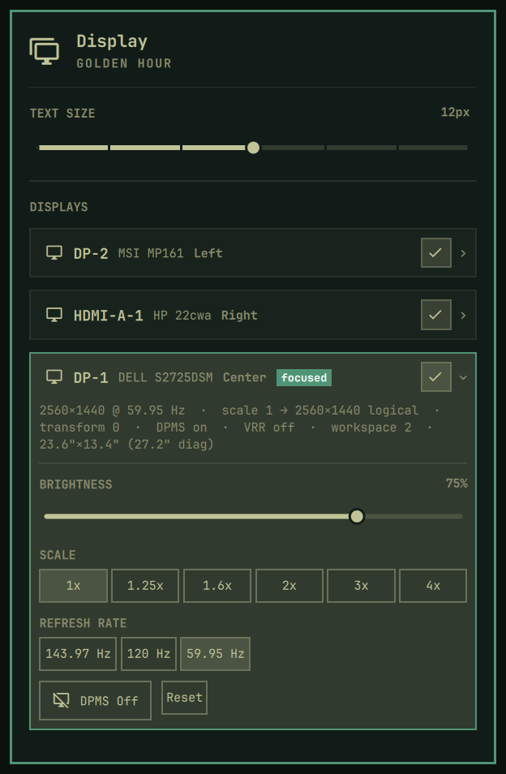

# Display & Monitor Manager (`fred.monitor`)

Display information, per-display control, multi-monitor alignment, and link reset plugin for [Omarchy Linux](https://omarchy.org) (Hyprland + Quickshell).



---

## Overview

`fred.monitor` replaces the stock Omarchy Display panel (`omarchy.monitor`) with an enhanced clone designed for multi-monitor setups. It adds per-display link retraining and reset, fixes stock multi-monitor scaling and toggle syntax issues, and provides clear visibility and control over connected displays.

| Item | Details |
| :--- | :--- |
| **Plugin ID** | `fred.monitor` |
| **Upstream Target** | `omarchy.monitor` |
| **License** | GPL-3.0-or-later |
| **Author** | Fred (@greenermoose) |
| **Repository** | `https://github.com/greenermoose/monitor-fred-tamlinux` |

---

## Features

- **Per-Display Cards**: Collapsed-by-default, highlighted-display-expanded cards showing rich hardware facts: resolution, refresh rate, logical scale, transform, DPMS, VRR, workspace, and physical size in inches.
- **Per-Display Controls**:
  - Individual DDC brightness sliders (cached, debounced; hidden when DDC is unavailable).
  - Clean scale preset pills preserving output coordinates.
  - Refresh-rate chips dynamically populated from supported modes at the current resolution.
  - DPMS toggle with a 10-second auto-restore safety countdown.
- **Link Reset / Retrain**: Per-display link retraining (`fred-monitor-reset`) to recover from DP/HDMI jitter or panel sync faults.
- **Stock Defect Fixes**:
  - Uses native Hyprland Lua syntax for display toggling (`hl.monitor({ output = ..., disabled = true/false })`).
  - Applies monitor scaling without clobbering existing physical offsets and monitor positions.
- **Unified Keyboard Navigation**: `j`/`k` walks across card sub-rows and between cards; `h`/`l` adjusts sliders and steps through chips; `r`/`R` retrains link.
- **Running Version Visibility**: Running version displayed on bar icon hover tooltip and in the popup panel footer.
- **Hardened Process Execution**:
  - All process execution goes through a supervised `Launch.qml` component.
  - Closed environment with strict allowlists (`clearEnvironment: true`).
  - Watchdog timers enforcing strict process deadlines (SIGTERM followed by SIGKILL).
  - Strict input validation (`^[A-Za-z0-9._-]+$`) on monitor connector names.
  - Direct execution without ambient shell string interpolation.

---

## Installation

Install and enable the plugin via Omarchy:

```bash
omarchy plugin add https://github.com/greenermoose/monitor-fred-tamlinux.git --enable
```

Because `fred.monitor` declares `clonedFrom: "omarchy.monitor"`, Omarchy automatically replaces the stock Display widget in place on the bar.

---

## License & Attribution

- Licensed under **GNU General Public License v3.0 or later** ([`LICENSE`](LICENSE)).
- Cloned from stock Omarchy [`omarchy.monitor`](/usr/share/omarchy/shell/plugins/panels/monitor/) (MIT License). See [`UPSTREAM.md`](UPSTREAM.md) for provenance details and diff recipe.
